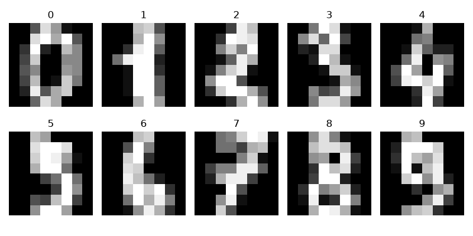
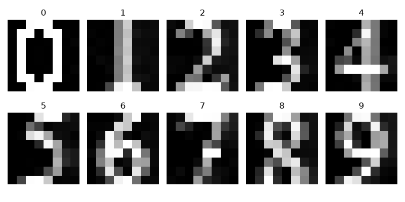

# 🔢 Handwritten Digit Recognition using Logistic Regression

A machine learning project that recognizes handwritten digits using **Logistic Regression** and the **scikit-learn Digits dataset**. The project includes both **multiclass (0–9)** and **binary (0 vs 1)** classification tasks and demonstrates how a trained model can predict custom digit images.


## Overview

This repository contains two machine learning projects based on the **scikit-learn Digits dataset**.

### 1. Multiclass Classification
A Logistic Regression model is trained to recognize all handwritten digits from **0 to 9**. After training, the model predicts custom digit images stored in the **test dataset** folder.

### 2. Binary Classification
A second Logistic Regression model is trained using only digits **0** and **1** to demonstrate binary classification.

Together, these projects provide a beginner-friendly introduction to supervised machine learning, including data preparation, model training, evaluation, and prediction.


## Features

### 🔹 Multiclass Digit Classification (0–9)

- 🤖 Logistic Regression classifier
- 📊 Uses the scikit-learn Digits dataset
- 📈 Automatic train/test split
- 🎯 Classification accuracy evaluation
- 📉 Mean Squared Error (MSE)
- 🖼️ Prediction on custom digit images using OpenCV
- 📏 Displays dataset dimensions
- 📚 Beginner-friendly implementation

### 🔹 Binary Digit Classification (0 vs 1)

- ✂️ Filters the dataset to digits **0** and **1**
- 🤖 Logistic Regression classifier
- 📈 Automatic train/test split
- 🎯 Classification accuracy evaluation
- 📉 Mean Squared Error (MSE)
- 📋 Displays predicted and actual labels


## Technologies Used

- Python 3
- NumPy
- OpenCV
- Scikit-learn
- Matplotlib


## Dataset

This project uses the **Digits Dataset** provided by **scikit-learn**.

Dataset characteristics:

- **1,797 handwritten digit samples**
- **64 features per sample (8 × 8 grayscale image)**
- **10 digit classes (0–9)**

For the binary classification project, the dataset is filtered to include only digits **0** and **1**.

The multiclass project also predicts custom digit images located inside the **test dataset** folder.


## Machine Learning Workflow

### Multiclass Classification

1. Load the Digits dataset.
2. Split the dataset into training and testing sets.
3. Train a Logistic Regression model.
4. Evaluate the trained model.
5. Predict custom digit images.
6. Measure prediction accuracy.

### Binary Classification

1. Load the Digits dataset.
2. Filter the dataset to keep only digits **0** and **1**.
3. Split the dataset into training and testing sets.
4. Train a Logistic Regression model.
5. Evaluate the trained model.


## Project Structure

```text
Handwritten-Digit-Recognition/
│
├── digits_logistic_regression.py
├── binary_digits_classifier.py
├── test dataset/
│   ├── 0.jpg
│   ├── 1.jpg
│   ├── ...
│   └── 9.jpg
├── screenshots/
│   ├── custom_digits.png
│   └── digits_dataset_sample.png
├── requirements.txt
├── LICENSE
└── README.md
```


## Installation

Clone the repository:

```bash
git clone https://github.com/Matin-python/Handwritten-Digit-Recognition.git
```

Move into the project directory:

```bash
cd Handwritten-Digit-Recognition
```

Install the required packages:

```bash
pip install -r requirements.txt
```

or install them manually:

```bash
pip install numpy opencv-python scikit-learn matplotlib
```


## How to Run

### Multiclass Classification

```bash
python digits_logistic_regression.py
```

### Binary Classification

```bash
python binary_digits_classifier.py
```


## Evaluation Metrics

### Multiclass Classification

- ✅ Classification Accuracy
- 📉 Mean Squared Error (MSE)
- 🎯 Accuracy on custom digit images

### Binary Classification

- ✅ Classification Accuracy
- 📉 Mean Squared Error (MSE)

## Dataset

This project uses the **Digits Dataset** from **scikit-learn**, which contains **1,797 handwritten digit samples** represented as **8×8 grayscale images**.

The trained model is also tested on custom digit images stored in the **test dataset** folder.

### Sample from the scikit-learn Digits Dataset

<p align="center">
  
</p>

### Sample Custom Test Images

<p align="center">
  
</p>

## Example Output

### Multiclass Classification

```text
==================================================
digits.data.shape = (1797, 64)

digits.images.shape = (1797, 8, 8)
==================================================

Correct Prediction = 97.5%

Mean Squared Error = 0.04

Predicted Output = [0 1 2 3 4 5 6 7 8 9]

Real Output = [0 1 2 3 4 5 6 7 8 9]

Accuracy Score = 100%
```

### Binary Classification

```text
==================================================
new_data.shape = (360, 64)

new_target.shape = (360,)
==================================================

Output Prediction =
[0 1 0 1 ...]

Real Output =
[0 1 0 1 ...]

Correct Prediction = 100.0%

Mean Squared Error = 0.0
```

> **Note:** Results may vary because the training and testing data are randomly split each time the program is executed.


## Related Projects

This repository is part of a collection exploring different machine learning algorithms for handwritten digit recognition.

### 🎯 Handwritten Digit Clustering using K-Means

An unsupervised learning project that groups handwritten digits into clusters without using labels during training.

Repository:
https://github.com/Matin-python/Digit-Clustering-using-K-Means


## Future Improvements

- 📊 Confusion Matrix visualization
- 📈 Precision, Recall, and F1-score
- 🔢 Support for additional classifiers (KNN, SVM, Decision Trees, Random Forest)
- 🎨 Interactive GUI for drawing digits
- 📷 Real-time webcam digit recognition
- 🧠 Deep Learning implementation using Convolutional Neural Networks (CNNs)
- 💾 Save and load trained models
- 🌐 Deploy as a web application using Flask or FastAPI


## Contributing

Contributions, suggestions, and bug reports are welcome. Feel free to fork the repository and submit a pull request.


## License

This project is licensed under the MIT License.


## Author

**Mohammad Reza Bakhshandeh**

Electrical Engineering (Electronics) Graduate

Interested in Python Development, Machine Learning, Deep Learning, Computer Vision, Artificial Intelligence, and Game Development.
